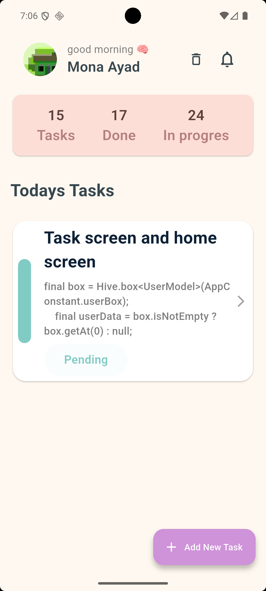
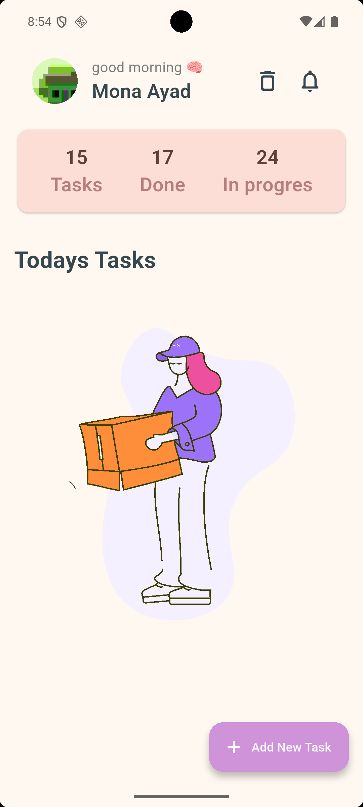
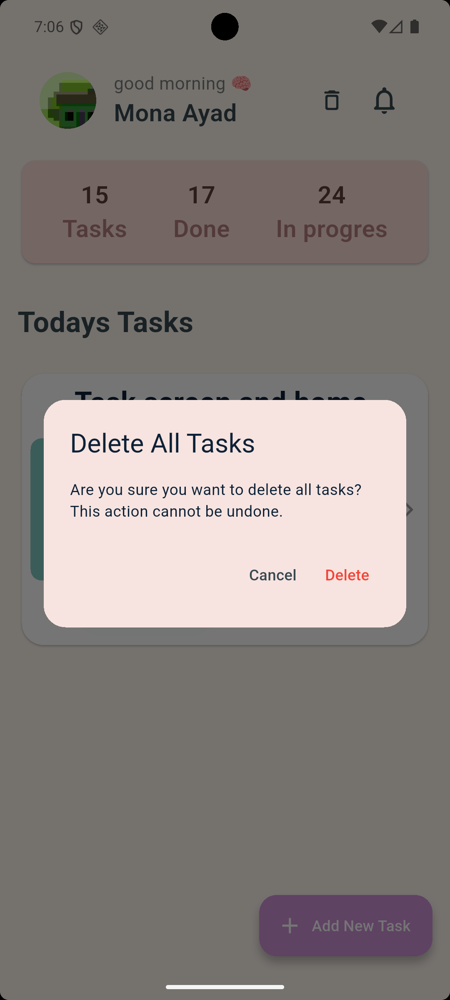
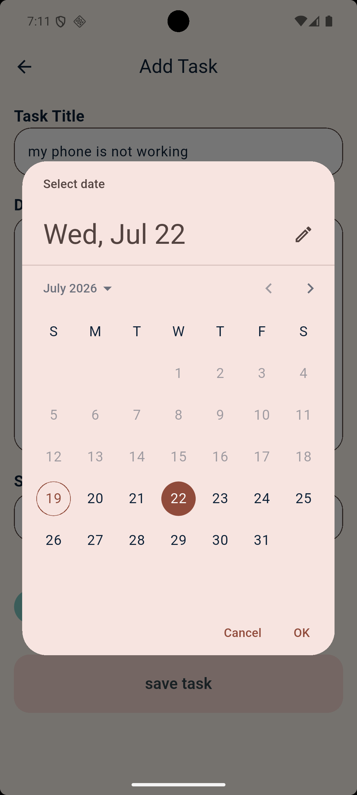
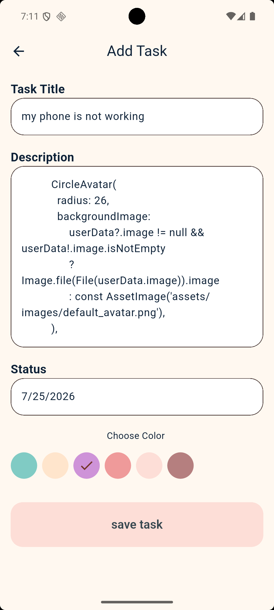
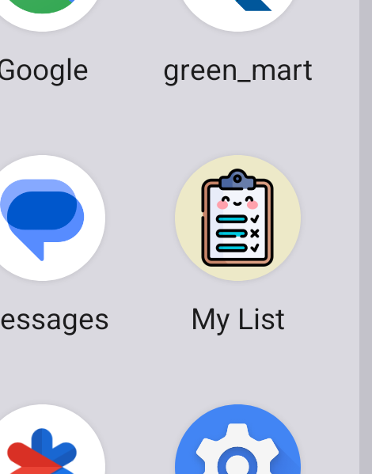

# ⚙️ To Do List App - Flutter

A practical Flutter application built to manage daily tasks, demonstrating clean UI implementation and core layout concepts.

---

## 📸 Screenshots

  
  
    
    
    
    
    
      

---
_Developed by Mona_